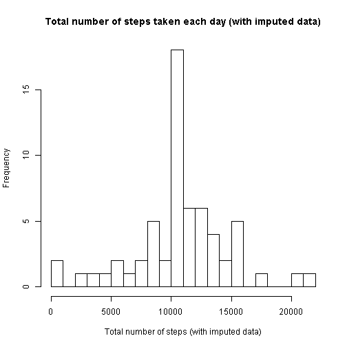

# Reproducible Research: Peer Assessment 1


## Introduction

It is now possible to collect a large amount of data about
personal movement using activity monitoring devices such as
a
[Fitbit](http://www.fitbit.com),
[Nike Fuelband](http://www.nike.com/us/en_us/c/nikeplus-fuelband),
or
[Jawbone Up](https://jawbone.com/up).
These type of devices are part of the "quantified self"
movement -- a group of enthusiasts who take measurements about
themselves regularly to improve their health, to find patterns
in their behavior, or because they are tech geeks. But these
data remain under-utilized both because the raw data are hard
to obtain and there is a lack of statistical methods and
software for processing and interpreting the data.

This assignment makes use of data from a personal activity
monitoring device. This device collects data at 5 minute
intervals through out the day. The data consists of two months
of data from an anonymous individual collected during the
months of October and November, 2012 and include the number of
steps taken in 5 minute intervals each day.


## Loading and preprocessing the data

The data for this assignment can be downloaded from the course web site:

* Dataset: [Activity monitoring data](https://d396qusza40orc.cloudfront.net/repdata%2Fdata%2Factivity.zip) [52K]

The variables included in this dataset are:

* **steps**: Number of steps taking in a 5-minute interval (missing
    values are coded as `NA`)

* **date**: The date on which the measurement was taken in YYYY-MM-DD
    format

* **interval**: Identifier for the 5-minute interval in which
    measurement was taken

The dataset is stored in a comma-separated-value (CSV) file and there
are a total of 17,568 observations in this dataset.

First, read the activity dataset:

```r
dataset_file <- unzip("activity.zip")
activity_data <- read.csv("activity.csv")
```

Next, transform the date factors to objects of the Date class:

```r
activity_data$date <- as.Date(activity_data$date)
```


## What is mean total number of steps taken per day?

For this part of the assignment, we will ignore the missing values (NA) in the activity dataset. To determine the total number of steps taken each day, we will use the `aggregate` function:

```r
steps_per_day <- aggregate(steps ~ date, data = activity_data, sum)
```

We can now plot a histogram showing the total number of steps taken each day:


```r
hist(steps_per_day$steps, breaks = 30, main = "Total number of steps taken each day", xlab = "Total number of steps")
```

 

The **mean** total number of steps taken per day is:

```r
mean(steps_per_day$steps)
```

```
## [1] 10766
```

The **median** total number of steps taken per day is:

```r
median(steps_per_day$steps)
```

```
## [1] 10765
```


## What is the average daily activity pattern?

1. Make a time series plot (i.e. `type = "l"`) of the 5-minute interval (x-axis) and the average number of steps taken, averaged across all days (y-axis).

Again, we make use of the `aggregate` function:

```r
mean_steps <- aggregate(steps ~ interval, data = activity_data, mean)
plot(steps ~ interval, data = mean_steps, type = "l", xlab = "Interval", ylab = "Average number of steps taken")
```

 

2. Which 5-minute interval, on average across all the days in the dataset, contains the maximum number of steps?

```r
max_steps <- max(mean_steps$steps)
max_row <- which(mean_steps$steps == max_steps)
max_row
```

```
## [1] 104
```

```r
mean_steps[row(mean_steps) == max_row]
```

```
## [1] 835.0 206.2
```

Interval **835** contains the maximum number of steps **206.1698**.


## Imputing missing values

Note that there are a number of days/intervals where there are missing values (coded as `NA`). The presence of missing days may introduce bias into some calculations or summaries of the data.

1. The total number of missing values in the dataset (i.e. the total number of rows with `NA`s) is:

```r
length(which(is.na(activity_data$steps)))
```

```
## [1] 2304
```

2. To fill in the missing **steps** values (coded as `NA`) in the dataset, we will use the mean of the steps for that particular 5-minute interval. Conveniently, these replacement values were previously calculated when determining the maximum number of steps (and available in **mean_steps**).

3. We will now create a new dataset that is equal to the original dataset but with the missing data filled in.

```r
activity_imputed <- activity_data
activity_imputed$steps <- ifelse(is.na(activity_imputed$steps), mean_steps$steps, activity_imputed$steps)
```

By comparing the first few rows of each data set, we can verify the missing **steps** values have been successfully replaced with the corresponding values from **mean_steps**.

```r
head(mean_steps)
```

```
##   interval   steps
## 1        0 1.71698
## 2        5 0.33962
## 3       10 0.13208
## 4       15 0.15094
## 5       20 0.07547
## 6       25 2.09434
```

```r
head(activity_data)
```

```
##   steps       date interval
## 1    NA 2012-10-01        0
## 2    NA 2012-10-01        5
## 3    NA 2012-10-01       10
## 4    NA 2012-10-01       15
## 5    NA 2012-10-01       20
## 6    NA 2012-10-01       25
```

```r
head(activity_imputed)
```

```
##     steps       date interval
## 1 1.71698 2012-10-01        0
## 2 0.33962 2012-10-01        5
## 3 0.13208 2012-10-01       10
## 4 0.15094 2012-10-01       15
## 5 0.07547 2012-10-01       20
## 6 2.09434 2012-10-01       25
```

4.We can now make a histogram of the total number of steps taken each day using the dataset containing imputed values, using the `aggregate` function:

```r
steps_per_day_imputed <- aggregate(steps ~ date, data = activity_imputed, sum)
hist(steps_per_day_imputed$steps, breaks = 30, main = "Total number of steps taken each day (with imputed data)", xlab = "Total number of steps (with imputed data)")
```

 

The **mean** total number of steps taken per day (with imputed data) is:

```r
mean(steps_per_day_imputed$steps)
```

```
## [1] 10766
```

The **median** total number of steps taken per day (with imputed data) is:

```r
median(steps_per_day_imputed$steps)
```

```
## [1] 10766
```

The **mean** total number of steps taken per day is the same as that from the first part of the assignment, while the **median** total number of steps taken per day has increased by 1 step. The impact of imputing missing data on these estimates has been relatively minor. Why the **median** total number of steps taken per day increased by 1 step may be a topic of further interest. From comparison of the histograms, the frequencies of the total number of steps taken per day has increased (since imputed values only increase the total number of steps taken per day), but the shapes of the histograms remain similar.

As an aside, let us compare **steps_per_day** and **steps_per_day_imputed**:

```r
length(steps_per_day$date)
```

```
## [1] 53
```

```r
length(steps_per_day_imputed$date)
```

```
## [1] 61
```

Imputing data for missing **step** values provided us with **8** additional days for the imputed data histogram.


## Are there differences in activity patterns between weekdays and weekends?

For this part, we will make use of the `weekdays` function, and **activity_imputed**, the dataset with the filled-in missing values.

1. Create a new factor variable in the dataset with two levels - "**weekday**" and "**weekend**", indicating whether a given date is a weekday or weekend day.

```r
activity_imputed$day <- ifelse(weekdays(activity_imputed$date) %in% c("Saturday", "Sunday"), "weekend", "weekday")
```
We can now calculate the average number of steps taken, averaged across all weekend days, using the `aggregate` function:

```r
mean_steps_weekend <- aggregate(steps ~ interval, data = activity_imputed[activity_imputed$day == "weekend",], mean)
```

Similarly, we can also calculate the average number of steps taken, averaged across all weekday days, using the `aggregate` function:

```r
mean_steps_weekday <- aggregate(steps ~ interval, data = activity_imputed[activity_imputed$day == "weekday",], mean)
```

2. Make a panel plot containing a time series plot (i.e. `type = "l"`) of the 5-minute interval (x-axis) and the average number of steps taken, averaged across all weekday days, or weekend days (y-axis).


```r
# set up parameters for the panel plot
par(mfrow = c(2, 1))
par(mar = c(0, 0, 0, 0), oma = c(4, 4, 0.5, 4))
par(tcl = -0.25)
par(mgp = c(2, 0.6, 0))

# plot the average number of steps taken averaged across weekend days
plot(steps ~ interval, data = mean_steps_weekend, type = "l", xlab = "", ylab = "", axes = FALSE)
mtext("weekend", side = 3, line = -1, adj = 0.1, cex = 0.8, col = "grey40")
axis(4, col = "grey40", col.axis = "grey20", at = seq(0, 150, 50))
box(col = "grey60")

# plot the average number of steps taken averaged across weekday days
plot(steps ~ interval, data = mean_steps_weekday, type = "l", xlab = "", ylab = "", axes = FALSE)
mtext("weekday", side = 3, line = -1, adj = 0.1, cex = 0.8, col = "grey40")
axis(1, col = "grey40", col.axis = "grey20", at = seq(0, 2000, 500))
axis(2, col = "grey40", col.axis = "grey20", at = seq(0, 200, 100))
box(col = "grey60")

# add annotations for the overall panel plot
mtext("Interval", side = 1, outer = TRUE, line = 2.2, col = "grey20")
mtext("Number of steps (with imputed data)", side = 2, outer = TRUE, line = 2.2, col = "grey20")
```

 

Note: the above panel plot utilizes the base graphics system; no additional graphics libraries were used.
